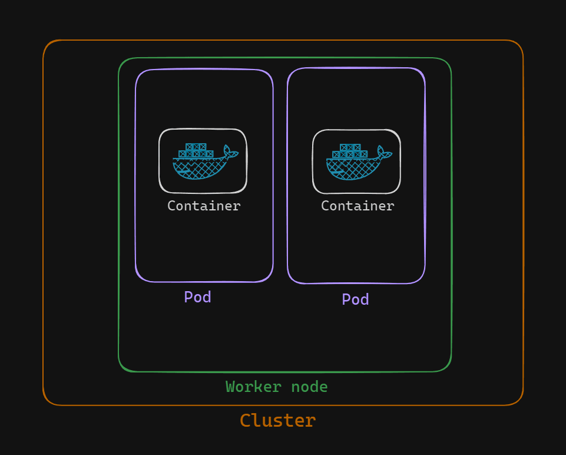

# Create and Execute Commands in a Kubernetes Pod

In this lab, we will learn how to create a Kubernetes pod and execute commands inside the pod. This skill is fundamental for managing applications running in Kubernetes, as it allows us to interact directly with the containerized applications for debugging, monitoring, and management purposes.



## Task
- Create a pod using the nginx:latest image.
- Execute a command inside the running pod to interact with the nginx server.
- Verify that the command has been executed successfully.

### Create a pod
There are two ways to create a pod:

    - Imperative approach
    - Declarative approach

#### Imperative approach
Run the following command to create a pod using the nginx:latest image:
```sh
kubectl run my-nginx --image=nginx:latest --restart=Never --port=80
```
#### Declarative approach
Create the YAML file and open it using vim:
```sh
vim my-pod.yaml
```
Paste the following content into my-pod.yaml:
```sh
apiVersion: v1
kind: Pod
metadata:
    name: my-nginx
spec:
    containers:
    - name: nginx
      image: nginx:latest
      ports:
      - containerPort: 80
```
Save and close the file.Apply the YAML file:
```sh
kubectl apply -f my-pod.yaml
```

### Verify the pod
To verify that the pod has been created and is running
```sh
kubectl get pods
```

### Execute a Command Inside the Pod
To execute a command inside the running my-nginx pod, use the kubectl exec command. For example, to open a shell inside the pod:
```sh
kubectl exec -it my-nginx -- /bin/sh
```
Here, `kubectl exec -it my-nginx` executes a command in the `my-nginx` pod.

`-- /bin/sh` opens a shell inside the container.

Inside the shell, we can run commands to interact with the pod. For instance, we can list files, check the Nginx version, or inspect running processes. For example, to check the Nginx version:
```sh
nginx -v
```
To exit the shell use the following command from inside the shell:
```sh
exit
```
