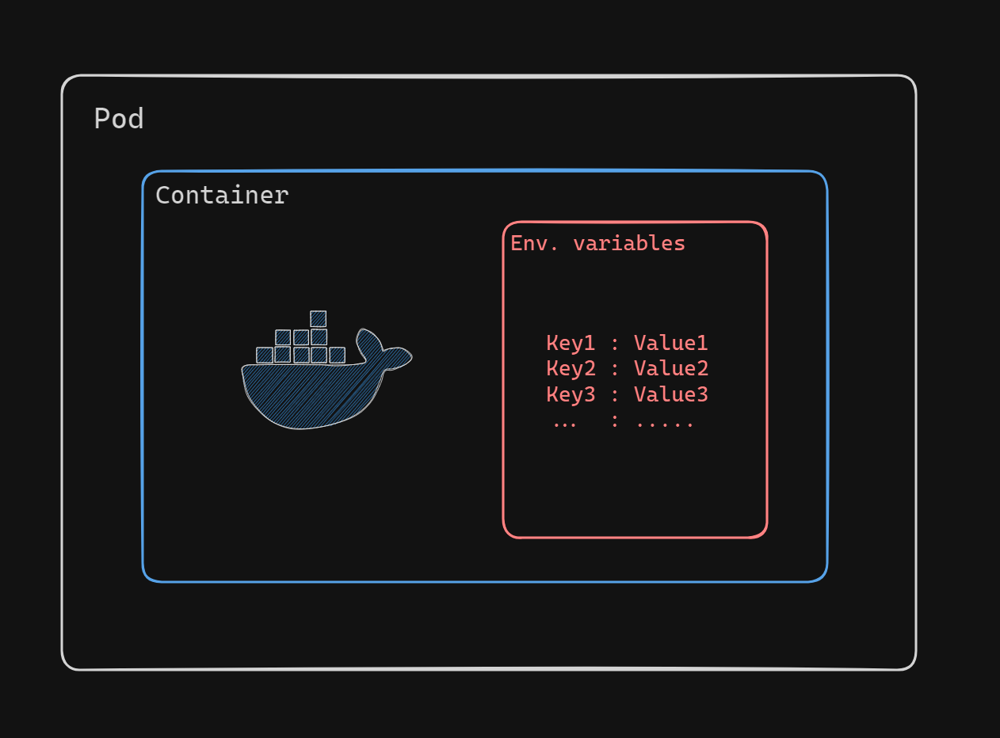
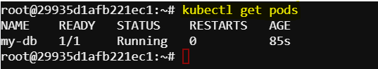
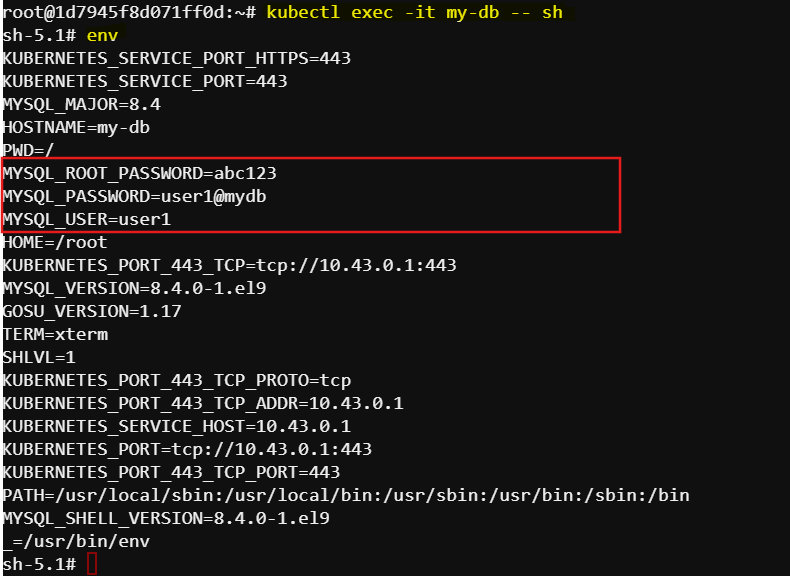

# Passing Environment Variables to Pods in Kubernetes
Environment variables are commonly used to configure applications and provide runtime parameters without modifying the application code or container image. There are many ways to set environment variables such as using plain key-value pairs, using configMaps, using secrets etc. In this exercise we will pass environment variables using simple key-value pairs.



There are two ways of creating pods with environment variables: imperatively and declaratively. We can use any one of this approach.

## Task
Create a kubernetes pod named `my-db` using the `mysql:latest` image. Define three environment variables within the container:

`MYSQL_ROOT_PASSWORD` set to `abc123`

`MYSQL_USER` set to `user1`

`MYSQL_PASSWORD` set to `user1@mydb`

### Imperative Approach
The following command creates a Kubernetes Pod named "my-db" with the given environment variables:
```sh
kubectl run my-db --image=mysql:latest --env="MYSQL_ROOT_PASSWORD=abc123" --env="MYSQL_USER=user1" --env="MYSQL_PASSWORD=user1@mydb"
```
### Declarative Approach
Create a YAML menifest file for the pod with given environment variables `pod-definitions.yaml`:
```sh
apiVersion: v1
kind: Pod
metadata:
    name: my-db
spec:
    containers:
    - name: mysql-container
      image: mysql:latest
      env:
      - name: MYSQL_ROOT_PASSWORD
        value: abc123
      - name: MYSQL_USER
        value: user1
      - name: MYSQL_PASSWORD
        value: user1@mydb
```
Create a pod with this YAML manifest using the following command:
```sh
kubectl create -f pod-definitions.yaml
```
Verifying the pod and environment variables
Use the following command to see the created pod:
```sh
kubectl get pod
```
Expected result:



Use the following command to see the pod details:
```sh
kubectl describe pod my-db
```
Now, let's check the environment variables from inside the container:
```sh
kubectl exec -it my-db -- sh
```
This command connects to the `my-db` pod. It starts a `shell` session inside the container running in the `my-db` pod. Because of the `-it` flag, the session is interactive, meaning we can type commands into the shell and see the output immediately.

Inside the shell of the container run:
```sh
env
```
This will show the environment variables from inside the container:

