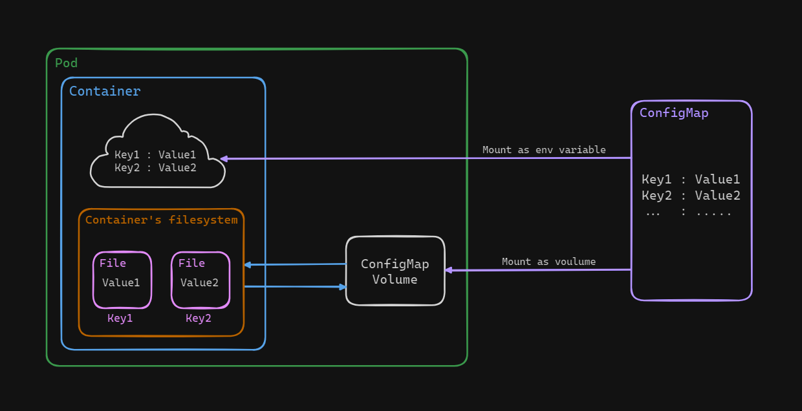
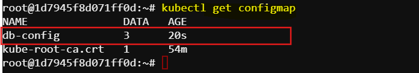
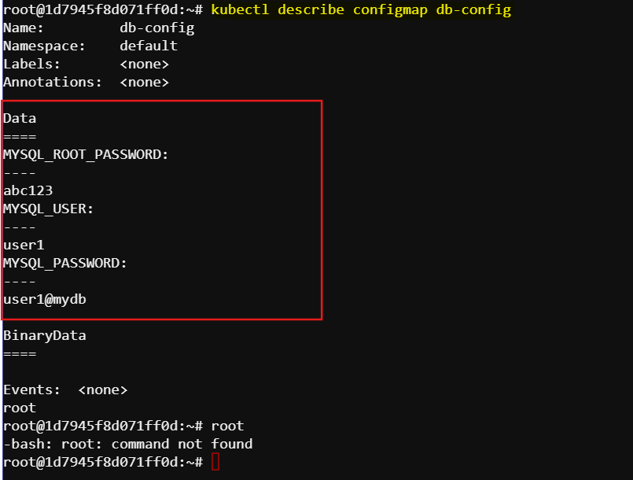

# Creating ConfigMap Object in Kubernetes
A ConfigMap in Kubernetes is like a dictionary that stores configuration data, such as environment variables, in key-value pairs. It's used to separate configuration from application code.


In Kubernetes, there are two primary ways to mount a ConfigMap into a pods. Here's an explanation of both methods:

### 1. Mounting a ConfigMap as Environment Variables
Mounting a ConfigMap as environment variables allows the configuration data to be exposed as environment variables within the container. This method is useful for simple key-value configurations and for applications that read configuration from environment variables.

### 2. Mounting a ConfigMap as a Volume
Mounting a ConfigMap as a volume allows the configuration data to be exposed as files within a specified directory in the container's filesystem. The key becomes the filename and value becomes the file content. This method is particularly useful when you have multiple configuration files or you want to leverage Kubernetes' ability to manage and update configuration files dynamically.

Here is a demonstration of how to mount a ConfigMap:



There are two ways to create a configMap just like any other kubernetes object:

- Imperative Approach
- Declarative Approach

## Task: Create a ConfigMap
Create a ConfigMap named `db-config` in Kubernetes containing environment variables for a MySQL database configuration:

Environment variables to be included:

`MYSQL_ROOT_PASSWORD`: `abc123`

`MYSQL_USER`: `user1`

`MYSQL_PASSWORD`: `user1@mydb`

Imperative Approach
Here is the format for these approach.
```sh
kubectl create configmap \
    <config-name> \
    --from-literal=<key>=<value> \ 
    --from-literal=<key>=<value>
```
We can use the following command to create a configMap for out task:
```sh
kubectl create configmap db-config --from-literal=MYSQL_ROOT_PASSWORD=abc123 --from-literal=MYSQL_USER=user1 --from-literal=MYSQL_PASSWORD=user1@mydb
```
This will create the required configMap.

Declarative Approach
Create a file named `config-map.yaml` using vim/nano and define the YAML manifest:
```sh
apiVersion: v1
kind: ConfigMap
metadata:
    name: db-config
data:
    MYSQL_ROOT_PASSWORD: abc123
    MYSQL_USER: user1
    MYSQL_PASSWORD: user1@mydb
```
Then run the following command:
```sh
kubectl create -f config-map.yaml
```
### Verifying the configmap
We can view the created configMaps:
```sh
kubectl get configmap
```
Expected result:


To see the details of this configMap use the following command:
```sh
kubectl describe configmap db-config
```
Expected result:

