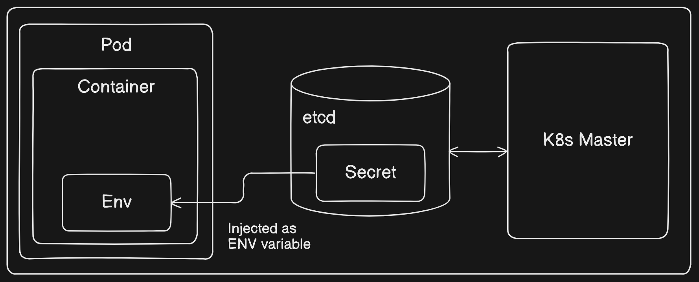
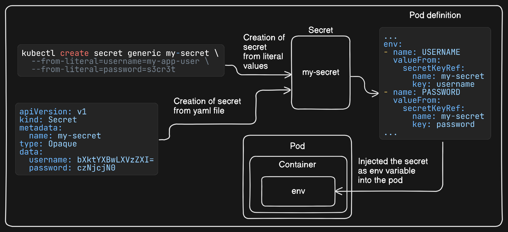
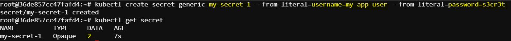
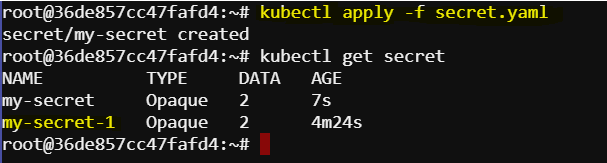
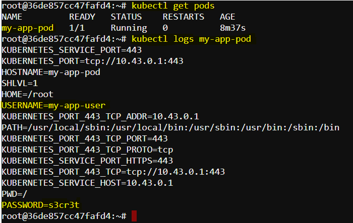

# Injecting Secret as Environment Variables
In Kubernetes, `secrets` are used to store and manage sensitive information, such as passwords, OAuth tokens, and SSH keys. By injecting secrets as environment variables, we can securely provide this sensitive information to out applications running inside Pods.

How does it works?
Secrets live out their lives in etcd, the central datastore for the entire Kubernetes system. This is the same central location where declarative definitions for Kubernetes Deployments live. This centralized storage approach allows users to create one Secret that can then be consumed by any number of Pods, whether those Pods are identical copies of one another (as would be the case with a Deployment or ReplicaSet) or not.



Mounting a secret as environment variables in a Kubernetes Pod involves creating a `Secret` object in Kubernetes and then referencing that secret in the `Pod's specification`. Kubernetes will then inject the secret's data as environment variables into the container(s) within the Pod.

## Task: Create secrete and inject as environment variable
Create a Secret named `my-secret` in Kubernetes containing environment variables for a pod named `my-app-pod`. The pod uses the `alpine` image.

Environment variables to be included:

`username`: `my-app-user`
`password`: `s3cr3t`
This is an overview of what we are going to do



### 1. Create a Secret
First, we need to create a secret in Kubernetes. Secrets can be created from literal values, files, or as YAML manifests.

Create a Secret from Literal Values
We can create a secret using kubectl by providing literal key-value pairs.
```sh
kubectl create secret generic my-secret --from-literal=username=my-app-user --from-literal=password=s3cr3t
```


This command creates a secret named my-secret with two keys: username and password.

Create a Secret Using a YAML Manifest
First we have to encode the secret value into base64. We can use base64 command to encode a string or file content.
```sh
echo -n 'my-app-user' | base64
echo -n 's3cr3t' | base64
```
Define the yaml secret file
```sh
apiVersion: v1
kind: Secret
metadata:
  name: my-secret
type: Opaque
data:
  username: bXktYXBwLXVzZXI=
  password: czNjcjN0      
``` 
To create the secret from the yaml file:
```sh
kubectl apply -f secret.yaml
```

### 2. Define a Pod that Uses the Secret
Create a YAML file for the Pod definition:
```sh
apiVersion: v1
kind: Pod
metadata:
  name: my-app-pod
spec:
  containers:
  - name: my-app-container
    image: alpine
    command: ["/bin/sh"]
    args: ["-c", "env && sleep 3600"]
    env:
    - name: USERNAME
      valueFrom:
        secretKeyRef:
          name: my-secret
          key: username
    - name: PASSWORD
      valueFrom:
        secretKeyRef:
          name: my-secret
          key: password
```
Here,

`USERNAME` environment variable is injected from the `username` key of the `my-secret secret`.
`PASSWORD` environment variable is injected from the `password` key of the `my-secret secret`.
Apply the pod definition:
```sh
kubectl apply -f my-app-pod.yaml
```
### 3. Verify the environment variables
Check if the pod created sucessfully
```sh
kubectl get pod
```
To verify that the environment variables are correctly injected, we can check the logs of the running Pod:
```sh
kubectl logs my-app-pod
```

Here, we can see the environment variables, including USERNAME and PASSWORD, listed in the output.