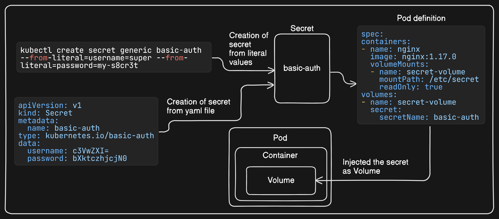
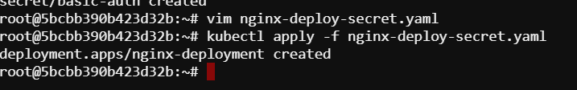
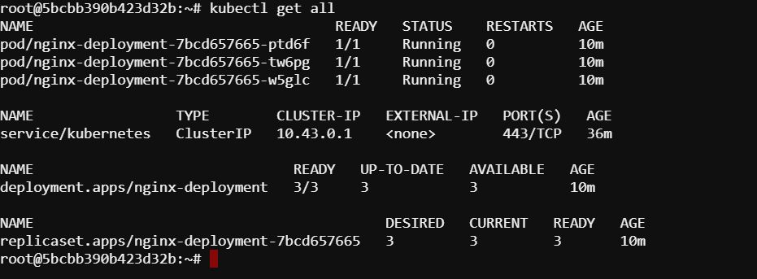
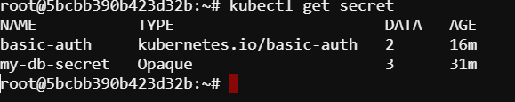
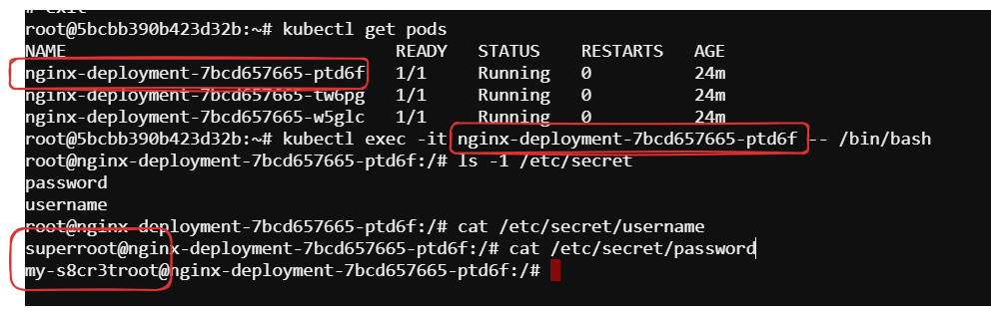

# Mounting a secret as a volume
## Task
In this lab, our task is to create a new Secret named `basic-auth` of type kubernetes.io/basic-auth. Assign the key-value pairs

`username=super`
`password=my-s8cr3t`
Mount the Secret as a volume with the path `/etc/secret` and `read-only` permissions to the Pods controlled by the Deployment.


## Steps
Here is the Overview of our task, mounting secret as a volume.


### 1. Create a secret
#### Create a Secret from Literal Values
We can create a secret using kubectl by providing literal key-value pairs.
```sh
kubectl create secret generic basic-auth --from-literal=username=super --from-literal=password=my-s8cr3t
```
This command creates a secret named `basic-auth` with two keys: `username` and `password`.

#### Create a Secret Using a YAML Manifest
First we have to encode the secret value into `base64`. We can use base64 command to encode a string or file content.
```sh
echo -n 'super' | base64
```
```sh
echo -n 'my-s8cr3t' | base64
```
Now we wil define a yaml definition file of name `secret.yaml`.
```sh
apiVersion: v1
kind: Secret
metadata:
  name: basic-auth
type: kubernetes.io/basic-auth
data:
  username: c3VwZXI=
  password: bXktczhjcjN0
```
```sh
kubectl apply -f secret.yaml
```

### 2. Create the deployment
For creating the deployment, we can define a yaml definition file `nginx-deploy-secret.yaml`
```sh
apiVersion: apps/v1
kind: Deployment
metadata:
  name: nginx-deployment
spec:
  replicas: 3
  selector:
    matchLabels:
      app: nginx
  template:
    metadata:
      labels:
        app: nginx
    spec:
      containers:
      - name: nginx
        image: nginx:1.17.0
        volumeMounts:
        - name: secret-volume
          mountPath: /etc/secret
          readOnly: true
      volumes:
      - name: secret-volume
        secret:
          secretName: basic-auth
```
```sh
kubectl apply -f nginx-deploy-secret.yaml
```

### 3. Verify the Deployment and Secret
Now we have to verify the deployment and the secret if they are created properly.
```sh
kubectl get all
```

```sh
kubectl get secret
```

### 4. View secret details
```sh
kubectl get secret basic-auth -o yaml
```

### 5. Verify Mount
To verify that the Secret is correctly mounted as a volume, we can exec into one of the Pods:
```sh
kubectl exec -it <pod_name> -- /bin/bash
```
Here, replace the `pod_name` with your pods name.
```sh
ls -1 /etc/secret
```
```sh
cat /etc/secret/username
cat /etc/secret/password
```

So, we have successfully mounted a secret as a volume with the specific path and the given requirements.