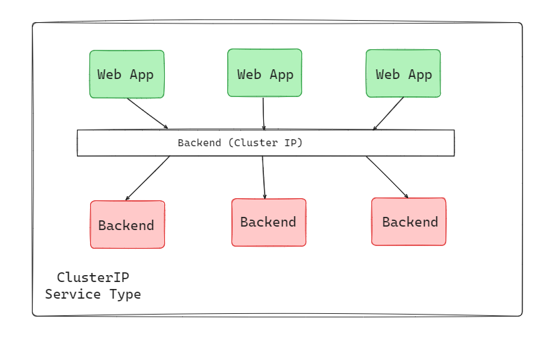
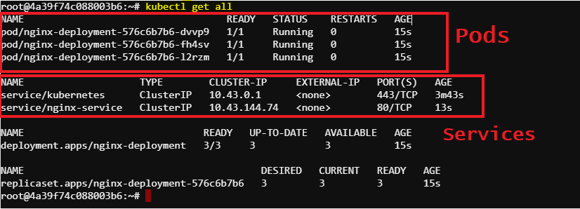
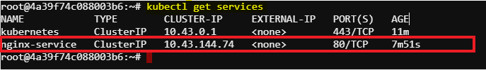

# Kubernetes Service Using ClusterIP
### ClusterIP


ClusterIP is the default service type in Kubernetes, and it provides internal connectivity between different components of our application. Kubernetes assigns a virtual IP address to a ClusterIP service that can solely be accessed from within the cluster during its creation. This IP address is stable and doesn’t change even if the pods behind the service are rescheduled or replaced.

## Task: Accessing Kubernetes Services via ClusterIP
This guide outlines the steps to create a nginx-deployment service and accessing the service using clusterIP. The final goal is to access the targeted nginx-pod and curl the application using ClusterIP internally within the cluster.


### Prerequisites
Install vim for creating YAML files in the system.
```sh
sudo apt update
sudo apt install vim
```
### Required Steps
#### 1. Create Nginx-deployment File
Let's create a Nginx-deployment file with three replica of pods running:
```sh
apiVersion: apps/v1
kind: Deployment
metadata:
  name: nginx-deployment
spec:
  replicas: 3
  selector:
    matchLabels:
      app: nginx
  template:
    metadata:
      labels:
        app: nginx
    spec:
      containers:
      - name: nginx
        image: nginx:latest
        ports:
        - containerPort: 80
```
use `vim nginx-deployment.yaml` and write the yaml file pressing `i` for INSERT and exit using `esc` and `:wq`.

Now, see the yaml file using cat nginx-deployment.yaml.

#### 2. Create Nginx-service File
Let's write a YAML manifest file for the Nginx-deployment file which specifies the service type as NodePort, allowing external access to the service.
```sh
apiVersion: v1
kind: Service
metadata:
  name: nginx-service
spec:
  selector:
    app: nginx
  ports:
    - protocol: TCP
      port: 80
      targetPort: 80
  type: ClusterIP
```
use `vim nginx-service.yaml` and write the yaml file pressing `i` for INSERT and exit using `esc` and `:wq`.

Now, see the yaml file using `cat nginx-service.yaml`.

#### 3. Create Deployment and Service
To create the deployment and service, run the following commands:
```sh
kubectl apply -f nginx-deployment.yaml
kubectl apply -f nginx-service.yaml
```
#### 4. Check Deployment and Service
Check the status of the deployment using:
```sh
kubectl get deployments
```
Check the status of the service using:
```sh
kubectl get services
```
We can also get all the information by using `kubectl get all`



If the pods and services are runnung, we are ready for accessing Nginx using ClusterIP within the cluster.

#### 5. Get the ClusterIP
To get the clusterIP of the service in a Kubernetes cluster, we can use the kubectl command-line tool to fetch this information. Here's how:
```sh
kubectl get services
```


#### 6. Curl using ClusterIP
We can access the Nginx server through the clusterIP of the nginx service internally.
```sh
curl http://10.43.144.74:80
```
### Expected Output
