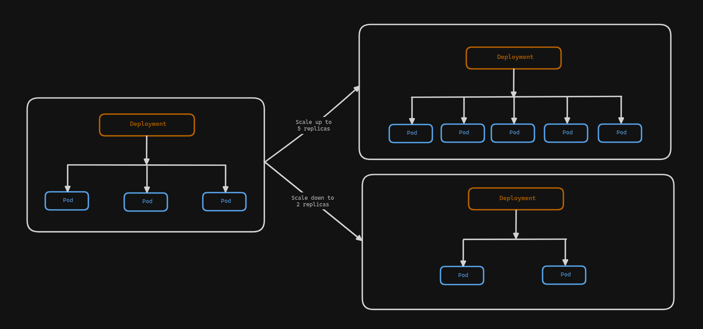

# Scaling the kubernetes deployment
A critical feature of Kubernetes that enables users to effectively manage the performance, availability, and resource use of their applications is scaling. Kubernetes provides strong mechanisms for application scaling whether handling changing workloads, traffic patterns, or changing business needs. Let's look at the task below to understand scaling.



## Task: Create and scale a deployment
We will create a deployment named `nginx-deployment` using the `nginx:latest` image setting the replicas to `three` initially. Then we will scale the deployment to `seven replicas` using the `kubectl scale` command. We will also varify the deployment and replicaset and pods.

### Creating a deployment
Use the following command to create a deployment:
```sh
kubectl create deployment nginx-deployment --image=nginx:latest --replicas=3 --port=80
```
It will create a deployment with a replicaset of the specified number of replicas. It uses the nginx image for the containers. we can see the created deployment, replicaset and pods using the following commands:
```sh
kubectl get deployment
kubectl get replicasets
kubectl get pods
```

### Scale the deployment
Here we can scale the deployment using the scale command:
```sh
kubectl scale deployment nginx-deployment --replicas=7
```
Now, if we see the deployment, replicaset and pods using the following commands:
```sh
kubectl get deployment
kubectl get replicasets
kubectl get pods
```