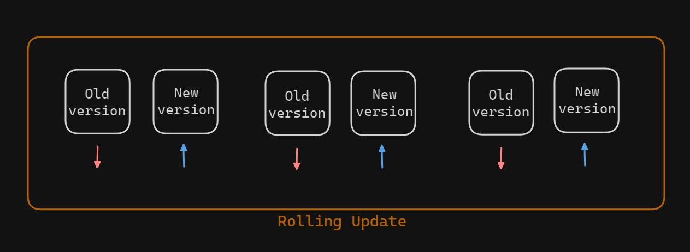
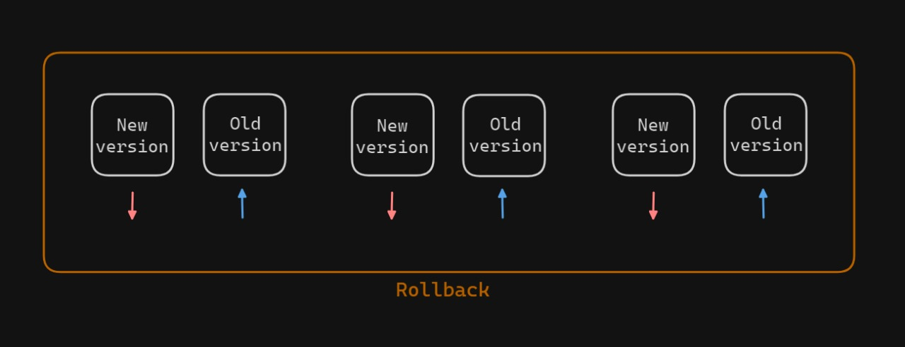
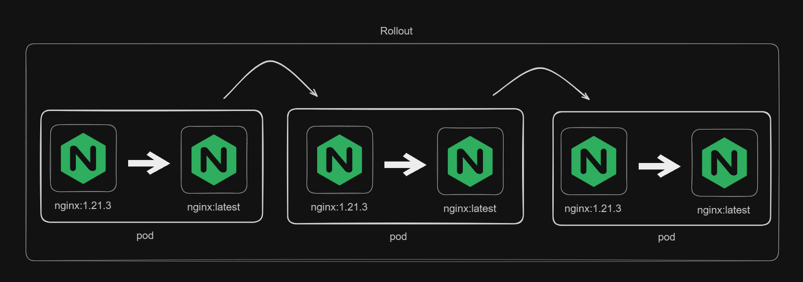

# Rolling Updates and Rollbacks in Kubernetes Deployment
In Kubernetes, rolling updates and rollbacks are vital for managing application deployments.

Rolling Update in Kubernetes: A rolling update in Kubernetes is a way to update applications running in your cluster without downtime. It gradually replaces old versions of the application with new ones, one pod at a time. This ensures that the application remains available to users throughout the update process.



Rollback in Kubernetes: A rollback in Kubernetes is the process of reverting an application to a previous version. This is useful if the new version has issues or bugs. Kubernetes keeps track of previous versions, allowing you to quickly revert to a stable state.



## Task
Create and apply a Kubernetes deployment using the NGINX image (version 1.21.3) with three replicas.

Update the deployment to use the latest NGINX image version and monitor the update process.

If issues arise, rollback the deployment to the previous version.

### Initialize Deployment with NGINX Image
To initialize a deployment with the NGINX image (version 1.21.3), we can create a YAML file with the following contents
```sh
apiVersion: apps/v1
kind: Deployment
metadata:
  name: nginx-deployment
spec:
  replicas: 3
  selector:
    matchLabels:
      app: nginx
  template:
    metadata:
      labels:
        app: nginx
    spec:
      containers:
      - name: nginx
        image: nginx:1.21.3
        ports:
        - containerPort: 80
```
By using the kubectl command `kubectl apply -f deployment.yaml` we can initialize the nginx deployments with 3 pods

### Rollout Update with New Image Version
To rollout an update with latest image version of nginx, we can edit the deployment's YAML configuration file to change the image version or we can use .After editing, apply the updated configuration using `kubectl apply`.This will trigger a rollout, updating the NGINX deployment with the new image version.



Update the image version from command line (optional)

Without configuring the yaml file we can simply set the image version in command
```sh
kubectl set image deployment nginx-deployment nginx=nginx:latest
```
To monitor the deployment's rollout progress
```sh
kubectl rollout status deployment nginx-deployment
```

To monitor the rollout history (optional)
```sh
kubectl rollout history deployment nginx-deployment
```

### Rollback the Update
If issues arise after the rollout and we need to rollback to the previous state, we can use the kubectl rollout undo command to go back to the previous version.
```sh
kubectl rollout undo deployment nginx-deployment
```
