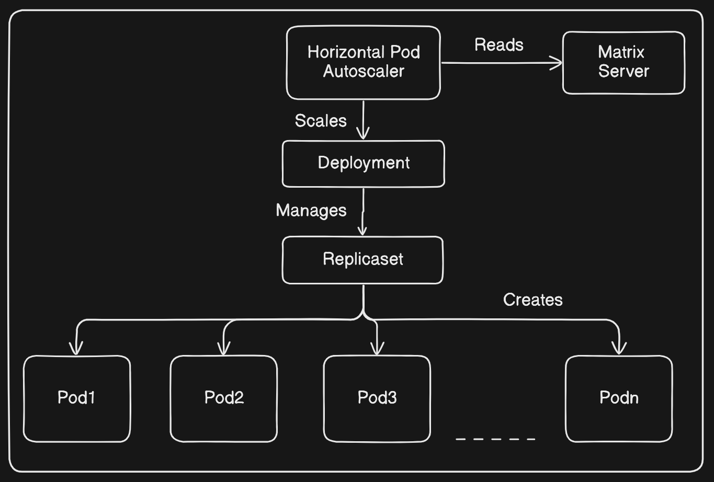

# Autoscaling a Deployment
This guide walks through the process of autoscaling a deployment in Kubernetes. It covers two main tasks:

## TASK
Creating a deployment named 'nginx' using the latest nginx image with initial replicas.
Establishing a Horizontal Pod Autoscaler (HPA) for the deployment, aiming for specific resource utilization metrics and setting minimum and maximum replica counts.

### Understanding Scalability in Kubernetes
Scalability refers to a system's ability to handle increasing load. In Kubernetes, scaling workloads involves dynamically adjusting the number of instances (replicas) of a workload based on demand or predefined metrics.

### Horizontal Pod Autoscaler (HPA)
The Horizontal Pod Autoscaler automatically scales the number of pods in a deployment, replica set, or stateful set based on observed CPU utilization, memory utilization, or custom metrics. It continuously adjusts the number of replicas to maintain a target utilization level specified in the HPA configuration.



#### Steps
1. Create a NGINX Deployment
Create a YAML manifest file for the deployment named nginx-deployment.yaml:
```sh
vim nginx-deployment.yaml
```
```sh
apiVersion: apps/v1
kind: Deployment
metadata:
  name: nginx
spec:
  replicas: 5
  selector:
    matchLabels:
      app: nginx
  template:
    metadata:
      labels:
        app: nginx
    spec:
      containers:
      - name: nginx
        image: nginx
```
Apply the deployment using the following command:
```sh
kubectl apply -f nginx-deployment.yaml
```
2. Create Horizontal Pod Autoscalers (HPA)
You can create an HPA for an existing Deployment using the kubectl autoscale command. For example:
```sh
kubectl autoscale deployment nginx --cpu-percent=80 --min=3 --max=10
```
3. View HPA Details
To view details about the Horizontal Pod Autoscaler, use the following command:
```sh
kubectl describe hpa nginx
```
You can also list all the Horizontal Pod Autoscalers:
```sh
kubectl get hpa
```

4. Define Resource Requirements
If the Pod template of the Deployment does not define resource requirements or if the metrics cannot be retrieved, the HPA might show `<unknown>` values. To solve this, define CPU and memory resource requirements in the pod definition.

Delete the existing nginx deployment:
```sh
kubectl delete deployment nginx
```
Update the nginx pod definition file `nginx-deployment.yaml` to include resource requirements:
```sh
apiVersion: apps/v1
kind: Deployment
metadata:
  name: nginx
spec:
  replicas: 2
  selector:
    matchLabels:
      app: nginx
  template:
    metadata:
      labels:
        app: nginx
    spec:
      containers:
      - name: nginx
        image: nginx
        resources:
          requests:
            memory: "64Mi"  # Request 64 megabytes of memory
            cpu: "50m"      # Request 50 millicores (0.05 cores) of CPU
          limits:
            memory: "128Mi" # Limit memory to 128 megabytes
            cpu: "100m"     # Limit CPU to 100 millicores (0.1 cores)
```
Apply the updated deployment:
```sh
kubectl apply -f nginx-deployment.yaml
```
Define an HPA object in a declarative way using a YAML manifest file nginx-hpa.yaml:
```sh
apiVersion: autoscaling/v2
kind: HorizontalPodAutoscaler
metadata:
  name: nginx
spec:
  scaleTargetRef:
    apiVersion: apps/v1
    kind: Deployment
    name: nginx
  minReplicas: 3
  maxReplicas: 10
  metrics:
  - type: Resource
    resource:
      name: cpu
      target:
        type: Utilization
        averageUtilization: 65
  - type: Resource
    resource:
      name: memory
      target:
        type: AverageValue
        averageValue: 1Gi
```
Apply the HPA manifest:
```sh
kubectl apply -f nginx-hpa.yaml
```