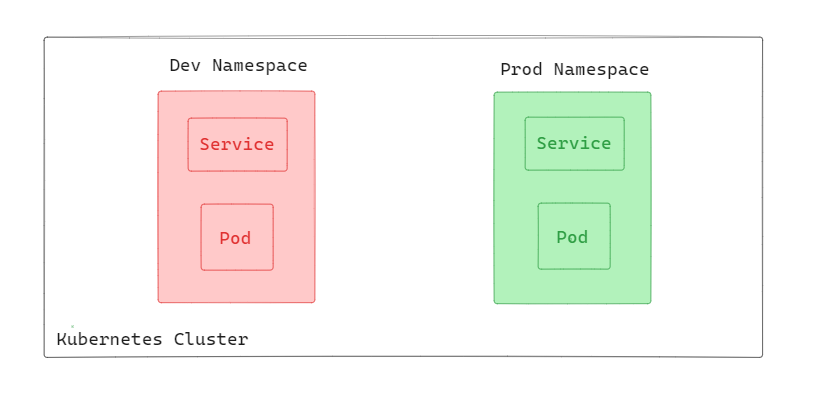
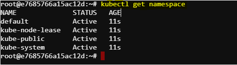
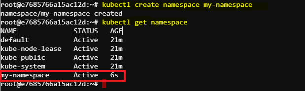
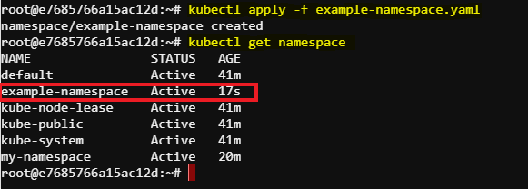
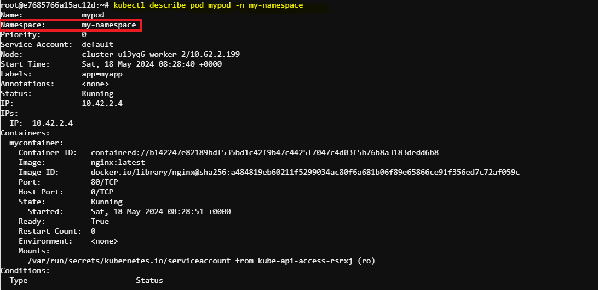
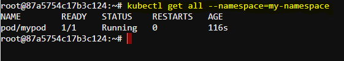
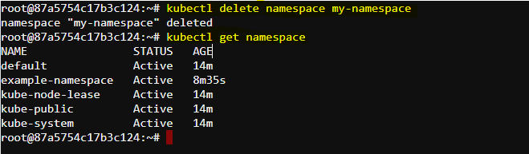

# Create Namespace in Kubernetes
Namespaces in Kubernetes provide a mechanism for isolating groups of resources within a single cluster. They are intended for use in environments with many users spread across multiple teams, or projects. Namespaces help to divide cluster resources between multiple users in a way that is logically separated.



In this diagram there a Kubernetes cluster divided into two primary namespaces: dev and prod. Each namespace serves a distinct purpose, with dev focusing on development and testing, while prod emphasizes stability and security with stricter resource quotas. These two namespaces help isolating resources between dev and prod.

## Initial Namespaces


Kubernetes starts with four initial namespaces:

default
kube-node-lease
kube-public
kube-system
We can see the initial namespaces using the following command:
```sh
kubectl get namespace
```


## Task: Creating a Namespace and Creating a pod definition file in a specific namespace
This document will guide you through the process of creating a namespace using command-line tool as well as using a YAML configuration file. We will further create a pod in a specfic namespace.

Namespaces can be created using the kubectl command-line tool or by defining them in a YAML configuration file.

### Creating a Namespace Using kubectl
We can create a new namespace called my-namespace by using the kubectl command.
```sh
kubectl create namespace my-namespace
```


### Creating a Namespace Using a YAML File
Install vim to edit/create the YAML file:
```sh
sudo apt update
sudo apt install vim
```
Create and open a YAML file for creating a namespace:

vim example-namespace.yaml
Now We can create a new namespace called example-namespace by using a YAML file.
```sh
apiVersion: v1
kind: Namespace
metadata:
    name: example-namespace
```
Apply the configuration with the following command:
```sh
kubectl apply -f example-namespace.yaml
```
The expected output:



### Creating a pod definition file in a specific namespace
Here we will create a simple pod definition file in the created namespace called my-namespace.

At first, we need to open a mypod.yaml file using vim and write a simple pod definition file.
```sh
apiVersion: v1
kind: Pod
metadata:
  name: mypod
  labels:
    app: myapp
spec:
  containers:
    - name: mycontainer
      image: nginx:latest
      ports:
        - containerPort: 80
```
Now we can create the pod in the namespace my-namespace we created earlier with the following command:
```sh
kubectl apply -f mypod.yaml --namespace=my-namespace
```
We can see the created pod using kubectl describe command and find that the pod has been created under the my-namespace namespace.


### Viewing Resources in a Namespace
To view all resources within a specific namespace:
```sh
kubectl get all --namespace=my-namespace
```


Here we can see there is one pod created and running in the my-namespace namespace.

### Deleting a Namespace
To delete a namespace and all the resources within it:
```sh
kubectl delete namespace my-namespace
```


There is no namespace called my-namespace after deletion.